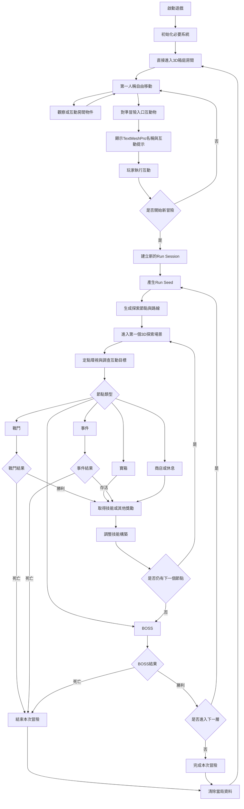

# AGENTS.md

## 專案目的

本專案目前處於遊戲雛型驗證階段。

開發優先目標是驗證：

- 第一人稱箱庭移動與互動。
- 透過互動物開始新的冒險循環。
- 種子式隨機探索關卡。
- 3D定點環視探索。
- 方向指令技能輸入。
- 敵人行動CD與技能冷卻。
- 防禦QTE。
- 基礎對話與敘事流程。

不要為尚未確認的正式版需求建立過度複雜的系統。

---

## 遊戲流程圖



### 流程檢查重點

修改遊戲流程前，確認以下事項：

1. 玩家啟動遊戲後必須直接進入箱庭房間。
2. 玩家不能透過傳統主選單進入主要循環。
3. 新冒險只能由箱庭中的指定互動物啟動。
4. 每次開始新冒險都必須建立新的Run Session與Run Seed。
5. 相同Seed與相同生成規則應產生相同的關卡結果。
6. 玩家死亡或完成冒險後，必須返回箱庭。
7. 返回箱庭後必須能再次開始新的冒險。
8. 箱庭、探索、戰鬥與對話必須使用正確的Input Action Map。
9. 對話、轉場或技能演出期間，不應接受不屬於當前狀態的輸入。
10. 不得因流程切換殘留上一局的技能、節點、敵人或敘事Runtime資料。

---

## 修改既有內容的規範

使用者可能會自行修改：

- 資料夾結構。
- 檔案名稱。
- Scene名稱。
- Prefab名稱。
- ScriptableObject名稱。
- 腳本名稱。
- Namespace。
- 類別名稱。
- 方法名稱。
- 欄位名稱。
- Assembly Definition。
- Input Action名稱。
- 程式架構與依賴關係。

因此，在修改任何既有內容前必須：

1. 先檢查目前專案中的實際檔案與程式碼。
2. 以目前存在的內容為準，不可只依照舊文件或先前推測。
3. 搜尋相關類別、介面、Prefab、Scene與引用位置。
4. 確認使用者是否已重新命名、搬移或重構。
5. 僅修改完成任務所需的最小範圍。
6. 保留使用者新增的程式碼、註解、命名與結構。
7. 不得用舊版本整份覆蓋目前檔案。
8. 不得因名稱不同就建立功能重複的新類別。
9. 不得擅自將使用者的架構改回文件中的建議架構。
10. 修改後檢查引用、Namespace、Assembly與序列化欄位是否仍然有效。

### 禁止行為

除非使用者明確要求，禁止：

- 整份重寫已有腳本。
- 刪除不理解用途的程式碼。
- 將使用者重新命名的類別改回舊名稱。
- 擅自搬移資料夾或檔案。
- 擅自重新命名Scene、Prefab或ScriptableObject。
- 擅自修改Assembly Definition依賴。
- 擅自替換Input Actions Asset。
- 擅自清除Inspector中已序列化的欄位。
- 擅自覆蓋ProjectSettings或Packages設定。
- 擅自導入新的第三方套件。
- 為雛型建立尚未需要的正式版系統。

### 發現結構與文件不一致時

若目前專案與企劃文件或AGENTS.md不同：

1. 以目前專案的實際內容為優先。
2. 不要自動還原。
3. 說明發現的差異。
4. 在現有結構上完成需求。
5. 只有在無法安全判斷時才停止修改並提出問題。

---

## 建立新檔案的規範

建立新檔案前：

1. 搜尋是否已有相同或相近功能。
2. 優先擴充既有模組，不建立重複系統。
3. 遵循目前專案的Namespace與命名方式。
4. 放入目前實際使用的資料夾結構。
5. 不要僅因企劃文件中存在某個建議路徑，就強制建立該路徑。
6. 新增公開API時，保持用途單一且容易替換。
7. 不要讓MonoBehaviour同時負責輸入、規則、UI、動畫與資料保存。

---

## 雛型架構原則

目前採用簡化架構：

```text
Presentation
Application
Domain
```

基本責任：

- Presentation：Unity物件、輸入、UI、鏡頭、動畫與場景呈現。
- Application：協調箱庭、探索、戰鬥、對話與冒險流程。
- Domain：技能、冷卻、傷害、QTE、種子生成與其他核心規則。

規範：

- 核心規則盡量使用純C#。
- 靜態設定優先使用ScriptableObject。
- 當局狀態使用Runtime物件。
- ScriptableObject不得保存會在遊戲中持續變動的當局狀態。
- 不要直接使用大量全域Singleton互相耦合。
- 不要建立同時處理所有功能的巨大Manager。
- 新增功能時優先使用組合，而非建立過深的繼承結構。
- 雛型階段不建立Infrastructure Layer與Save System。
- 雛型階段不建立完整VFX或Timeline流程。
- Addressables不是雛型必要依賴。

---

## Unity與套件規範

目前專案核心技術：

- Unity 6系列。
- Universal Render Pipeline。
- Input System。
- UniTask。
- Cinemachine。
- AI Navigation。
- Animation Rigging。
- uGUI。
- TextMeshPro。
- Test Framework。
- ProBuilder。

規範：

- 輸入使用新版Input System。
- 不要新增以`Input.GetKey`為核心的新輸入流程。
- 非同步流程使用UniTask時必須考慮CancellationToken。
- 不要使用`Time.timeScale`處理所有局部暫停。
- 敵人行動CD、技能CD與QTE時間應分開管理。
- TextMeshPro用於互動物名稱、互動提示、對話與主要UI文字。
- 第一人稱互動使用攝影機中心Raycast。
- Raycast只偵測指定Layer並限制互動距離。
- 互動物名稱應支援距離顯示與面向攝影機。
- 不要在核心隨機生成流程中分散使用`UnityEngine.Random`。
- 所有影響Run的隨機結果應由Run Seed控制。

---

## 文字編碼規範

所有文字檔案必須使用UTF-8。

包含但不限於：

- `.cs`
- `.md`
- `.json`
- `.asmdef`
- `.asmref`
- `.inputactions`
- `.uxml`
- `.uss`
- `.shader`
- `.txt`
- `.csv`
- 對話與資料檔案

規範：

1. 中文、日文與其他非ASCII文字直接以原始文字保存。
2. 不使用Unicode跳脫字元取代可直接閱讀的文字。
3. 不要將中文寫成例如：
   - `\u6df1\u6df5\u5165\u53e3`
   - `\u958b\u59cb\u5192\u96aa`
4. 應直接寫成：
   - `深淵入口`
   - `開始冒險`
5. JSON與C#字串同樣遵循此規範。
6. 除非格式或通訊協定強制要求，不要主動產生Unicode escape。
7. 修改檔案後確認沒有因編碼錯誤產生亂碼。
8. 不要隨意變更既有檔案的換行格式與編碼。

---

## 程式修改檢查

每次修改後至少確認：

- Unity腳本是否可編譯。
- 類別名稱與檔案名稱是否符合MonoBehaviour與ScriptableObject需求。
- Namespace引用是否正確。
- Assembly Definition依賴是否正確。
- Inspector序列化欄位是否可能遺失。
- Input Action Map與Action名稱是否存在。
- 場景切換後是否殘留錯誤狀態。
- UniTask流程是否能被取消。
- 事件訂閱是否有取消。
- Run Seed是否保持可重現。
- TextMeshPro引用是否存在。
- Raycast互動是否受距離、Layer與遮擋限制。
- 修改是否覆蓋到使用者原本的客製內容。

---

## 回覆與變更說明

完成修改後，應簡要列出：

1. 修改了哪些檔案。
2. 每個檔案修改了什麼。
3. 是否建立新檔案。
4. 是否變更資料夾、類別或公開API名稱。
5. 是否有需要使用者在Unity Inspector中手動設定的引用。
6. 是否有尚未驗證或可能影響既有內容的部分。

其他:
1.不要宣稱已完成未實際執行或未驗證的工作。
2.如果用量快使用完，就先告一段落，下次用量恢復後再繼續。
3.如果有任何不確定的部分，隨時可以詢問我來補充更多細節。
4.不要做過度的設計，保持乾淨的依賴。
